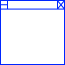

<div id="top"></div>


[![Contributors][contributors-shield]][contributors-url]
[![Forks][forks-shield]][forks-url]
[![Stargazers][stars-shield]][stars-url]
[![Issues][issues-shield]][issues-url]
[![MIT License][license-shield]][license-url]


<!-- PROJECT LOGO -->
<br />
<div align="center">
  <a href="https://github.com/a2937/Link-Extraction">
    
  </a>

<h3 align="center">Link-extraction</h3>

  <p align="center">
    Scrapes the given webpage for all links and outputs them to a file
    <br />
    <a href="https://github.com/a2937/Link-Extraction"><strong>Explore the docs »</strong></a>
    <br />
    <br />
    <a href="https://github.com/a2937/Link-Extraction/issues">Report Bug</a>
    ·
    <a href="https://github.com/a2937/Link-Extraction/issues">Request Feature</a>
  </p>
</div>


<!-- TABLE OF CONTENTS -->
<details>
  <summary>Table of Contents</summary>
  <ol>
    <li>
      <a href="#about-the-project">About The Project</a>
      <ul>
        <li><a href="#built-with">Built With</a></li>
      </ul>
    </li>
    <li>
      <a href="#getting-started">Getting Started</a>
      <ul>
        <li><a href="#prerequisites">Prerequisites</a></li>
        <li><a href="#installation">Installation</a></li>
      </ul>
    </li>
    <li><a href="#usage">Usage</a></li>
    <li><a href="#roadmap">Roadmap</a></li>
    <li><a href="#contributing">Contributing</a></li>
    <li><a href="#license">License</a></li>
    <li><a href="#contact">Contact</a></li>
    <li><a href="#acknowledgments">Acknowledgments</a></li>
  </ol>
</details>


<!-- ABOUT THE PROJECT -->
## About The Project

![Product Name Screen Shot][product-screenshot]

This is a project inspired by the need to check to see if all the links 
on a webpage were properly working; and the desire to get everything to work 
cross-platform. 

<p align="right">(<a href="#top">back to top</a>)</p>


### Built With

* [![Dotnet][Dotnet]][Dotnet-url]

<p align="right">(<a href="#top">back to top</a>)</p>


<!-- GETTING STARTED -->
## Getting Started

Clone or download the repo and open it in a code editor of your choice. 

### Prerequisites

This is an example of how to list things you need to use the software and how to install them.
* dotnet core 6.0
  ```sh
  curl https://dotnet.microsoft.com/en-us/download
  ```

### Installation

1. Clone the repo
   ```sh
   git clone https://github.com/a2937/Link-Extraction.git
   ```
2. Install dotnet core 6.0
   ```sh
   wget https://download.visualstudio.microsoft.com/download/pr/c246f2b8-da39-4b12-b87d-bf89b6b51298/2d43d4ded4b6a0c4d1a0b52f0b9a3b30/dotnet-sdk-6.0.302-win-x64.exe
   ```

<p align="right">(<a href="#top">back to top</a>)</p>


## Usage

- Checking to see if there are hidden links on the page
- Ensuring all links are active 
- Finding all downloads on a page 

<p align="right">(<a href="#top">back to top</a>)</p>


<!-- ROADMAP -->
## Roadmap

- [ ] Eventually support command line arguments
- [ ] Cross-platform GUI 
- [ ] Create more tests and organize them 

See the [open issues](https://github.com/a2937/Link-Extraction/issues) for a full list of proposed features (and known issues).

<p align="right">(<a href="#top">back to top</a>)</p>


<!-- CONTRIBUTING -->
## Contributing

Contributions are what make the open source community such an amazing place to learn, inspire, and create. Any contributions you make are **greatly appreciated**.

If you have a suggestion that would make this better, please fork the repo and create a pull request. You can also simply open an issue with the tag "enhancement".
Don't forget to give the project a star! Thanks again!

1. Fork the Project
2. Create your Feature Branch (`git checkout -b feature/AmazingFeature`)
3. Commit your Changes (`git commit -m 'Add some AmazingFeature'`)
4. Push to the Branch (`git push origin feature/AmazingFeature`)
5. Open a Pull Request

<p align="right">(<a href="#top">back to top</a>)</p>


<!-- LICENSE -->
## License

Distributed under the MIT License. See `LICENSE.txt` for more information.

<p align="right">(<a href="#top">back to top</a>)</p>


<!-- CONTACT -->
## Contact

Project Link: [https://github.com/a2937/Link-Extraction](https://github.com/a2937/Link-Extraction)

<p align="right">(<a href="#top">back to top</a>)</p>


<!-- ACKNOWLEDGMENTS -->
## Acknowledgments

* [othneildrew](https://github.com/othneildrew/Best-README-Template) : For the best readme template ever

<p align="right">(<a href="#top">back to top</a>)</p>


<!-- MARKDOWN LINKS & IMAGES -->
<!-- https://www.markdownguide.org/basic-syntax/#reference-style-links -->
[contributors-shield]: https://img.shields.io/github/contributors/a2937/Link-Extraction.svg?style=for-the-badge
[contributors-url]: https://github.com/a2937/Link-Extraction/graphs/contributors
[forks-shield]: https://img.shields.io/github/forks/a2937/Link-Extraction.svg?style=for-the-badge
[forks-url]: https://github.com/a2937/Link-Extraction/network/members
[stars-shield]: https://img.shields.io/github/stars/a2937/Link-Extraction.svg?style=for-the-badge
[stars-url]: https://github.com/a2937/Link-Extraction/stargazers
[issues-shield]: https://img.shields.io/github/issues/a2937/Link-Extraction.svg?style=for-the-badge
[issues-url]: https://github.com/a2937/Link-Extraction/issues
[license-shield]: https://img.shields.io/github/license/a2937/Link-Extraction.svg?style=for-the-badge
[license-url]: https://github.com/a2937/Link-Extraction/blob/master/LICENSE.txt
[product-screenshot]: images/screenshot.png
[Dotnet]: https://img.shields.io/badge/dotnet-512BD4?style=for-the-badge&logo=dotnet&logoColor=white
[Dotnet-url]: https://dotnet.microsoft.com/en-us/